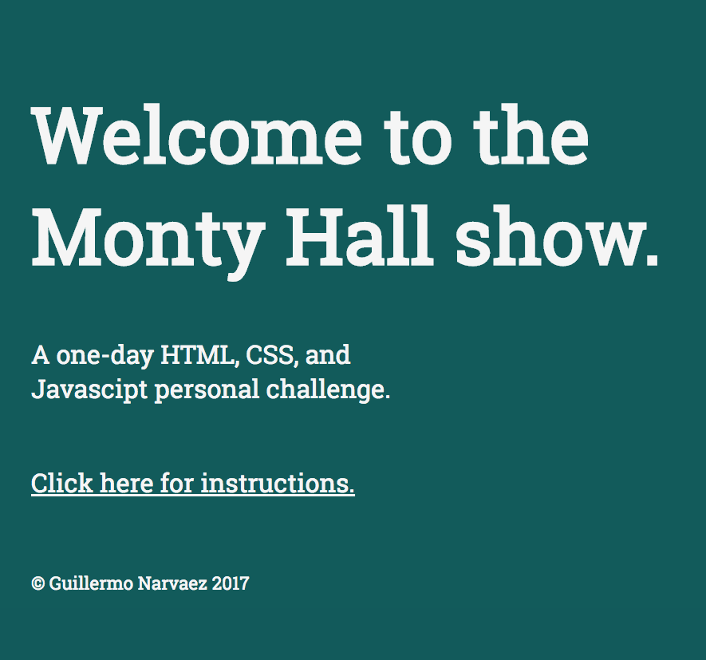

# Monty_Hall

This is a small one-day project whose purpose was to practice some HTML, CSS, and JavaScript after I taught it to myself. I thought it would be cool to code a site where the famous Monty Hall game could be simulated. Here I also explain why it's probabilistically better to ALWAYS change doors after Monty Hall has shown you one of the "Goat Doors".

## Access

The application is hosted in Heroku. You can check it out [here](https://monty-hall-show.herokuapp.com/).

### Purpose of the Site

The whole idea of this project was to allow me to make something after I taught myself the basics of HTML, CSS, JavaScript, and JQuery. This is a short didactical excersise that it's not meant to be perfect in any way. I enjoyed coding it, and I believe it's a cool site that can help you understand a near probabilistic phenomenon.

## The Site

